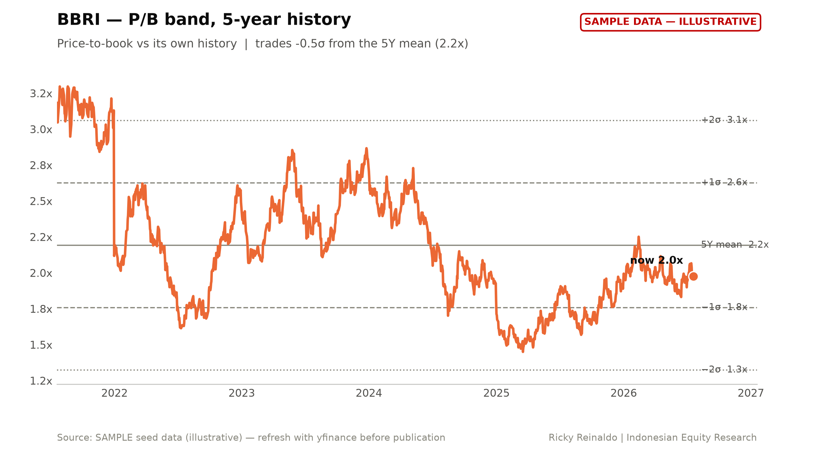
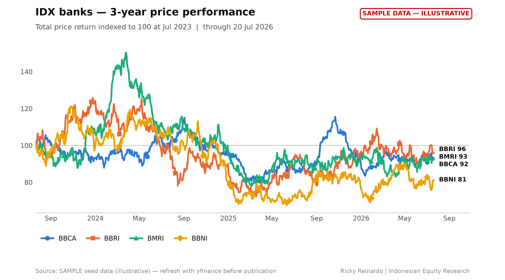
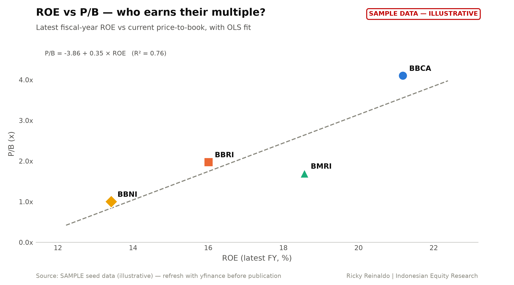
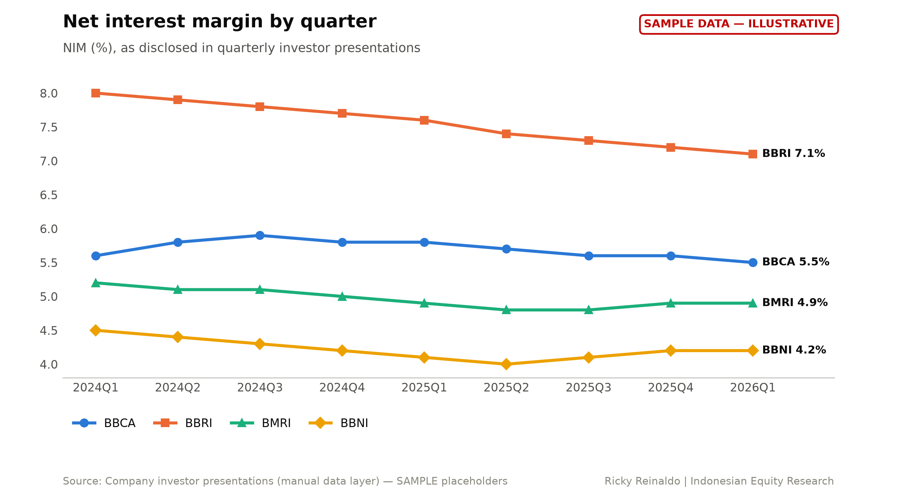
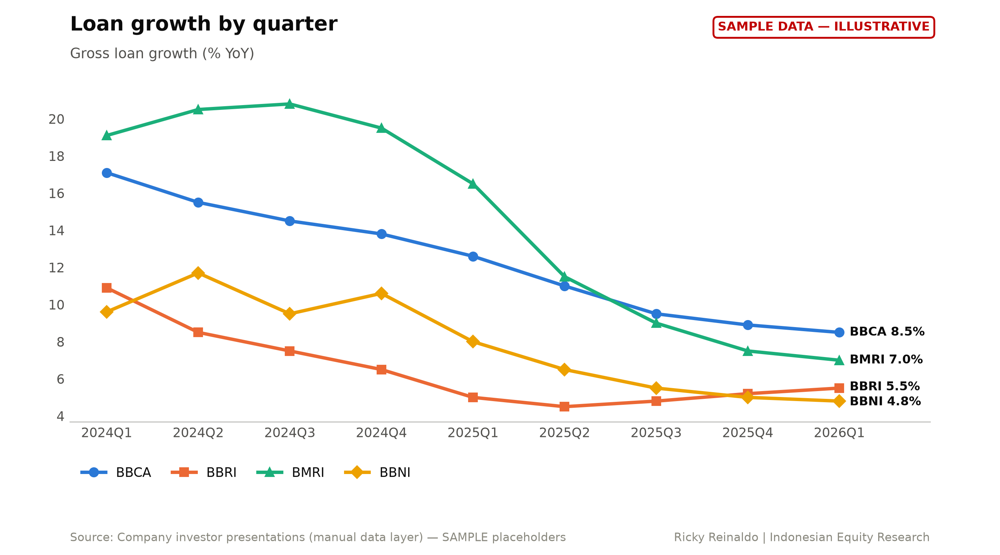

# PT Bank Rakyat Indonesia (Persero) Tbk (BBRI.JK) — Initiation of Coverage
*21 July 2026 · Ricky Reinaldo · Indonesian Equity Research*

> **DRAFT BUILT ON SAMPLE DATA — ILLUSTRATIVE ONLY, NOT FOR PUBLICATION**

| | | | |
|---|---|---|---|
| **Rating** | [SET RATING] | **P/E (FY25)** | 12.2x |
| **Price target (RI)** | IDR 3,980 | **P/B** | 2.0x |
| **Last close** | IDR 4,380 | **Div yield** | 7.9% |
| **Upside/(downside)** | -9.1% | **ROE** | 16.0% |
| **Market cap** | IDR 664 tn | **COE (CAPM)** | 11.40% |

## Investment thesis

*[TO WRITE — the system deliberately does not write this.]*

1. Thesis point 1 — the core reason to own (or avoid) the stock. State it in one sentence, then support it with two or three paragraphs of evidence.
2. Thesis point 2 — what the market is missing or mispricing.
3. Thesis point 3 — the catalyst path and timing.

## Company overview

*[TO WRITE]*

## Valuation

Residual income model: COE 11.40%, ROE fade 16.0% → 17.0% over 5y, payout 80%, terminal growth 5.0%.

**Fair value IDR 3,982** (implied P/B 1.80x) · DDM cross-check IDR 3,982 · upside -9.1%

| Year | ROE | BVPS open | EPS | DPS | RI | PV(RI) |
|---|---|---|---|---|---|---|
| 1 | 16.0% | 2,217 | 355 | 284 | 102 | 92 |
| 2 | 16.2% | 2,288 | 372 | 297 | 111 | 89 |
| 3 | 16.5% | 2,362 | 390 | 312 | 120 | 87 |
| 4 | 16.8% | 2,440 | 409 | 327 | 131 | 85 |
| 5 | 17.0% | 2,522 | 429 | 343 | 141 | 82 |

**Sensitivity (fair value, COE × terminal ROE)**

| COE \ ROE | 15.0% | 16.0% | 17.0% | 18.0% | 19.0% |
|---|---|---|---|---|---|
| 10.40% | 4,010 | 4,352 | 4,696 | 5,043 | 5,393 |
| 10.90% | 3,690 | 3,998 | 4,309 | 4,622 | 4,938 |
| 11.40% | 3,419 | 3,699 | 3,982 | 4,267 | 4,555 |
| 11.90% | 3,187 | 3,444 | 3,703 | 3,964 | 4,227 |
| 12.40% | 2,986 | 3,222 | 3,461 | 3,701 | 3,944 |

## Key exhibits

## Risks

*[TO WRITE — generic sector list:]*

- Macro: BI policy path, IDR volatility, sovereign yield moves.
- Asset quality: NPL formation and cost of credit vs assumptions.
- Competition/funding: deposit pricing pressure on NIM.
- Regulatory/political: SoE dividend policy, directed lending.

---
*This material is independent research prepared for educational purposes. It is not investment advice, an offer, or a solicitation to buy or sell any security. Figures may contain errors; verify against primary filings.*

**THIS DRAFT WAS BUILT ON SAMPLE PLACEHOLDER DATA — figures are illustrative and must not be published.**